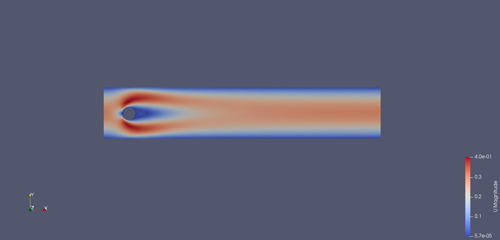
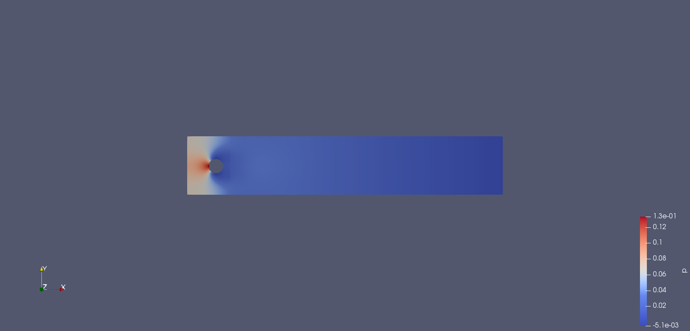
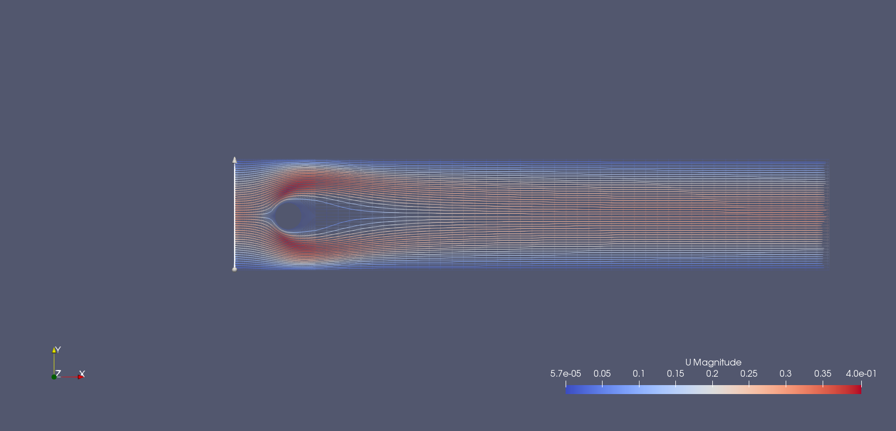
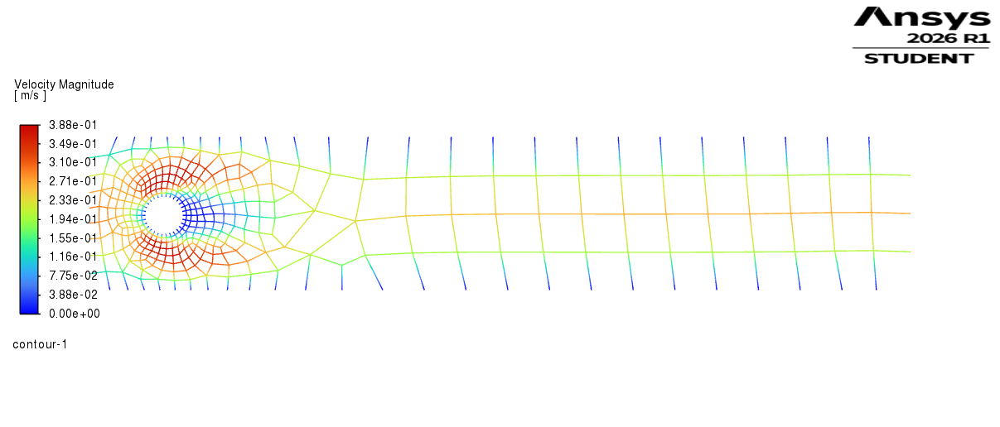
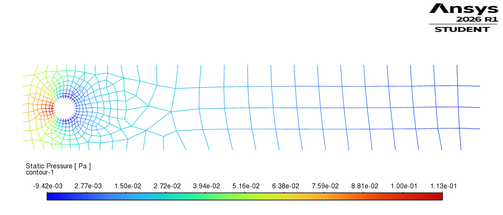
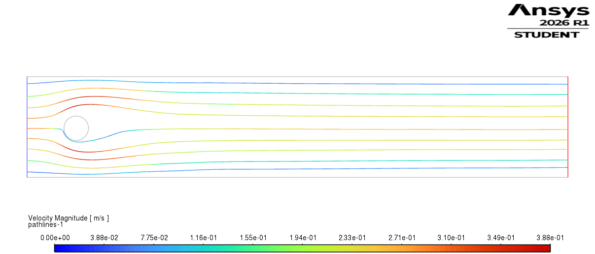
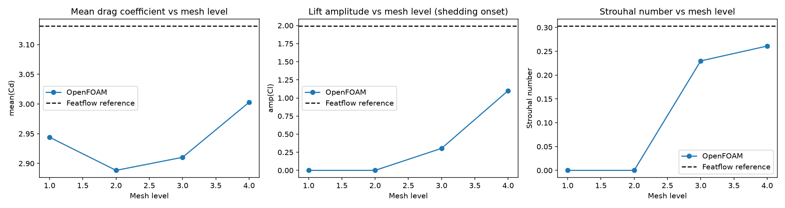

# DFG Flow-Around-a-Cylinder Benchmark — OpenFOAM vs Ansys Fluent

A classic CFD validation case (Schäfer & Turek, 1996) solved independently in two solvers and checked against the published Featflow reference values, with a mesh convergence study in each.

**Case:** laminar flow past a circular cylinder in a channel, at Re = 20 (steady) and Re = 100 (unsteady vortex shedding).

## Why this project

Anyone can point a solver at geometry and get an answer. The point here was to check whether that answer is *correct*, at what mesh resolution it becomes correct, and to understand why it sometimes isn't — the same discipline expected before trusting CFD results on a real design problem.

## Setup

- Custom 12-block O-grid mesh around the cylinder, four refinement levels (10/15/20/30 cells around the circumference), same topology across all levels and both solvers, so results are comparable level-to-level.
- Re = 20: steady solve (`simpleFoam` / Fluent Coupled steady).
- Re = 100: transient solve (`pimpleFoam` / Fluent transient), sampled over one settled shedding cycle per the official DFG measurement protocol.

## Results — Re = 20 (mesh convergence, finest level shown)

| Quantity | Featflow reference | OpenFOAM (30 cells) | Fluent (30 cells) |
|---|---|---|---|
| Drag coefficient (Cd) | 5.5795 | 5.6747 | 5.3956 |
| Lift coefficient (Cl) | +0.0106 | −0.0123 | −0.0294 |
| Pressure difference | 0.1175 | 0.1196 | 0.1037 |

<p align="center">
  
  
  
</p>
<p align="center">
  
  
  
</p>

*Top row: OpenFOAM. Bottom row: Fluent. Velocity magnitude, pressure, streamlines.*

**Finding — the lift sign flip:** Cl is small and notoriously ill-conditioned for this case. Both solvers, run through the *same* four-level mesh sweep, independently land on the wrong sign at their finest mesh (see `results/figures/re20_fluent_convergence.png`). That agreement across two unrelated codes is the interesting result — it points to the quantity itself being poorly conditioned at this Reynolds number, not a bug in either solver.

## Results — Re = 100 (OpenFOAM, four-level shedding study)

| Level | Cells around cylinder | Shedding observed | Strouhal number |
|---|---|---|---|
| 1 | 10 | **No** — numerically damped | — |
| 2 | 15 | **No** — numerically damped | — |
| 3 | 20 | Yes | 0.230 |
| 4 | 30 | Yes | 0.261 |
| Reference | — | Yes | 0.303 |

<p align="center">
  
</p>

**Finding — shedding onset threshold:** below ~15–20 cells around the cylinder, numerical diffusion fully suppresses the Kármán vortex street, even though the physical instability onset is around Re ≈ 47 — well below Re = 100. Above that threshold, every metric moves monotonically toward the reference with refinement.

## Tools

OpenFOAM 9 (WSL/Ubuntu) · Ansys Fluent 2026 R1 · Python (pandas, matplotlib) for post-processing and convergence plots.

## Repo structure

```
openfoam/        case files, Re=20 and Re=100, 4 mesh levels each
ansys-fluent/    case files, Re=20, 4 mesh levels
results/         figures/ and tables/ (raw convergence data as CSV)
scripts/         plot_convergence.py — regenerates the convergence plots from the CSVs
```