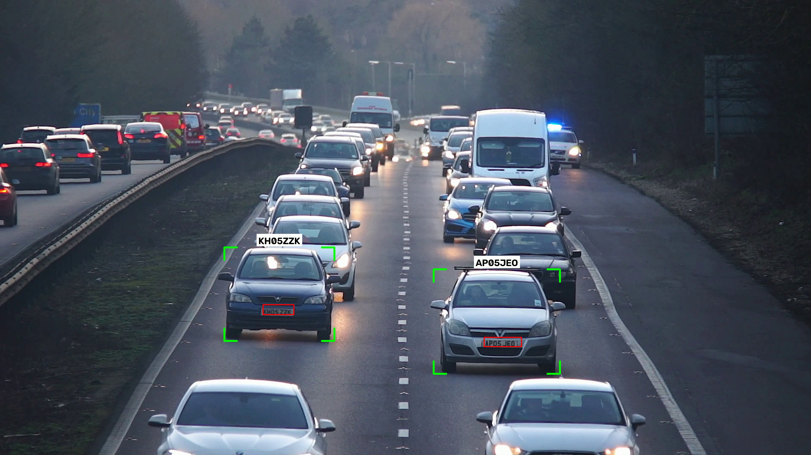
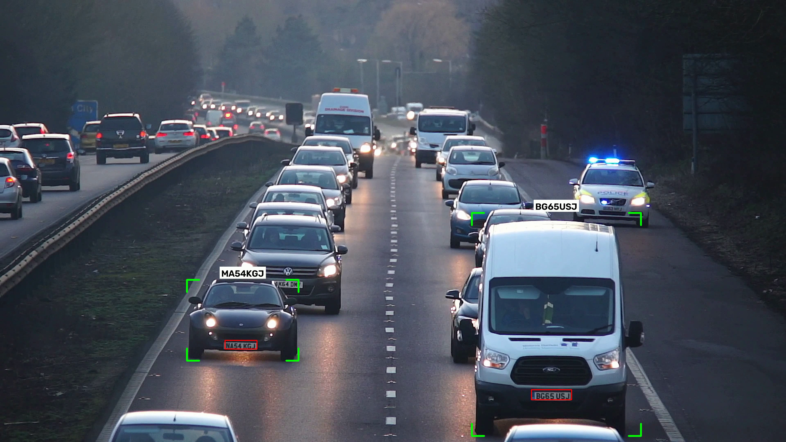

# License Plate Detection and Recognition (ANPR)

A complete automatic number plate recognition pipeline for traffic footage: vehicle and plate detection, multi object tracking, OCR, and a final annotated output video, built and trained independently outside of any coursework.

`YOLO26` `OpenCV` `EasyOCR` `SORT Tracking` `Computer Vision`

---

## What's in this repo

- **`main.py`** — runs vehicle and plate detection per frame, tracks vehicles across frames with SORT, crops and reads each plate with EasyOCR, writes raw results to `test.csv`.
- **`add_missing_data.py`** — interpolates bounding boxes for frames where a tracked vehicle was briefly missed, producing `test_interpolated.csv`.
- **`visualize.py`** — renders the final annotated output video from the interpolated data.
- **`util.py`** — shared helpers: UK plate format validation, OCR character correction, CSV writing, vehicle to plate matching.
- **`sort/`** — the SORT (Simple Online and Realtime Tracking) algorithm used for multi object tracking.
- **`docs/`** — example output screenshots.

## The problem

Reading license plates from real traffic footage means solving three separate problems at once: finding vehicles and plates in each frame, keeping track of which plate belongs to which vehicle as it moves across frames, and reading OCR accurately off a small, often blurry or angled crop. Getting any one of these wrong breaks the final read, so the project is really about getting a full pipeline of independent models to work together cleanly.

## Approach

- **Detection** — vehicles (car, motorcycle, bus, truck) are detected with a pretrained YOLO26 COCO model, plates are detected with a YOLO26 model I trained myself on a labeled Roboflow dataset.
- **Tracking** — SORT assigns a consistent ID to each vehicle across frames, so every plate reading gets tied to one specific car rather than treated frame by frame.
- **OCR and correction** — each plate crop is read with EasyOCR, then validated against the UK plate format (2 letters, 2 digits, 3 letters) and corrected for common character level confusions (0 and O, 5 and S, and similar) at the position they're expected to appear.
- **Selection and rendering** — the highest confidence reading per tracked vehicle is kept, gaps in detection are interpolated across frames, and the final video is rendered with bounding boxes and the resolved plate text overlaid.

## Results

Tested against real UK highway footage with manually verified ground truth plates:

| Metric | Value |
|---|---|
| Plate detector mAP50 | 0.985 |
| Plate detector mAP50-95 | 0.879 |
| End to end exact plate read accuracy | 63.2% |

Most remaining errors are single character OCR confusions between visually similar letters (V and W, C and G, for example) rather than detection or tracking failures, a fairly typical error profile for unconstrained real world footage.

  
  

## Tools

Python · Ultralytics YOLO26 · OpenCV · EasyOCR · SORT tracking · NumPy · pandas · SciPy, trained locally on an NVIDIA RTX 4070 with CUDA.

## License / Use

Personal project. Shared here for portfolio purposes.
